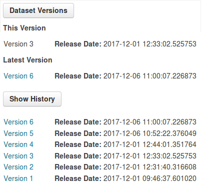
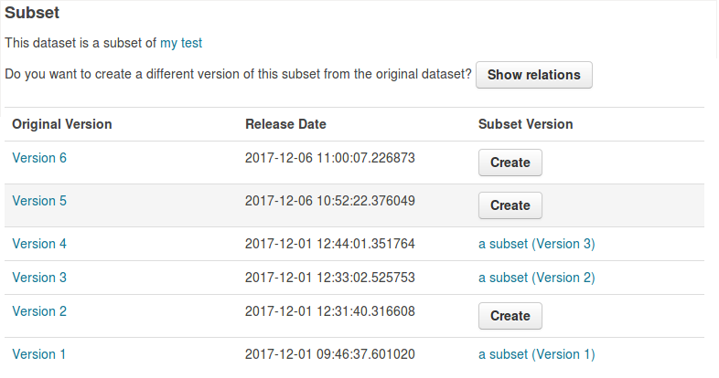

=============
ckanext-resourceversions
=============

This extension allows you to create versions of resources. Each version
becomes a new resource. Therefore, when uploading a new file or changing
the link of a resource a new resource is being created. However, when changing
any other information no new version is being created.

This extension must be used together with ckanext-thredds. Therefore, you can
create versions of subsets and show relations between the original resource
versions and the subset versions.

------------
Requirements
------------

This extension must be used together with ckanext-thredds. Moreover, each
resource needs a field "newer_version" and "subset_of".

------------
Installation
------------

To install ckanext-resourceversions:

1. Activate your CKAN virtual environment, for example::

     . /usr/lib/ckan/default/bin/activate

2. Install the ckanext-resourceversions Python package into your virtual environment::

     pip install ckanext-resourceversions

3. Add ``resourceversions`` to the ``ckan.plugins`` setting in your CKAN
   config file (by default the config file is located at
   ``/etc/ckan/default/production.ini``).

4. Restart CKAN. For example if you've deployed CKAN with Apache on Ubuntu::

     sudo service apache2 reload

---------------
Config Settings
---------------

Document any optional config settings here. For example::

    # The minimum number of hours to wait before re-checking a resource
    # (optional, default: 24).
    ckanext.resourceversions.some_setting = some_default_value

------------------------
Development Installation
------------------------

To install ckanext-resourceversions for development, activate your CKAN virtualenv and
do::

    git clone https://github.com/KatharinaSack/ckanext-resourceversions.git
    cd ckanext-resourceversions
    python setup.py develop
    pip install -r dev-requirements.txt

-----------------
Running the Tests
-----------------

To run the tests, do::

    nosetests --nologcapture --with-pylons=test.ini

To run the tests and produce a coverage report, first make sure you have
coverage installed in your virtualenv (``pip install coverage``) then run::

    nosetests --nologcapture --with-pylons=test.ini --with-coverage --cover-package=ckanext.resourceversions --cover-inclusive --cover-erase --cover-tests

---------------------------------
Registering ckanext-resourceversions on PyPI
---------------------------------

ckanext-resourceversions should be availabe on PyPI as
https://pypi.python.org/pypi/ckanext-resourceversions. If that link doesn't work, then
you can register the project on PyPI for the first time by following these
steps:

1. Create a source distribution of the project::

     python setup.py sdist

2. Register the project::

     python setup.py register

3. Upload the source distribution to PyPI::

     python setup.py sdist upload

4. Tag the first release of the project on GitHub with the version number from
   the ``setup.py`` file. For example if the version number in ``setup.py`` is
   0.0.1 then do::

       git tag 0.0.1
       git push --tags

----------------------------------------
Releasing a New Version of ckanext-resourceversions
----------------------------------------

ckanext-resourceversions is availabe on PyPI as https://pypi.python.org/pypi/ckanext-resourceversions.
To publish a new version to PyPI follow these steps:

1. Update the version number in the ``setup.py`` file.
   See `PEP 440 <http://legacy.python.org/dev/peps/pep-0440/#public-version-identifiers>`_
   for how to choose version numbers.

2. Create a source distribution of the new version::

     python setup.py sdist

3. Upload the source distribution to PyPI::

     python setup.py sdist upload

4. Tag the new release of the project on GitHub with the version number from
   the ``setup.py`` file. For example if the version number in ``setup.py`` is
   0.0.2 then do::

       git tag 0.0.2
       git push --tags
